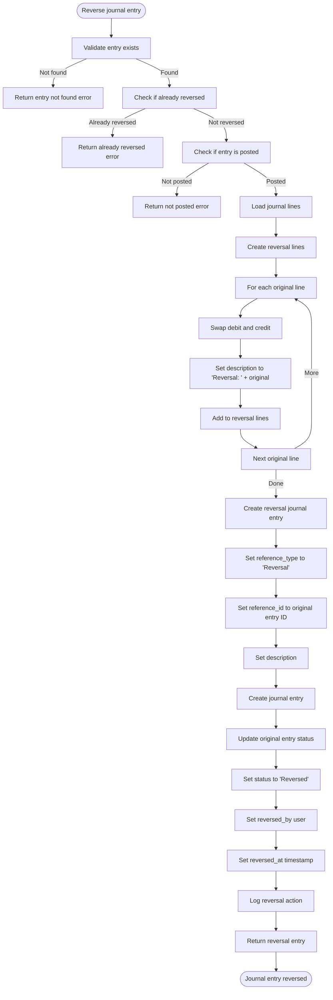
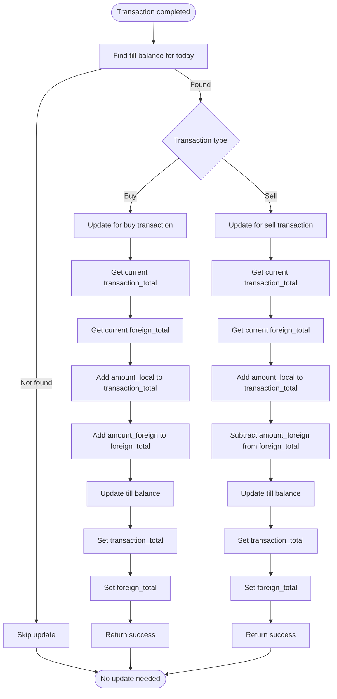
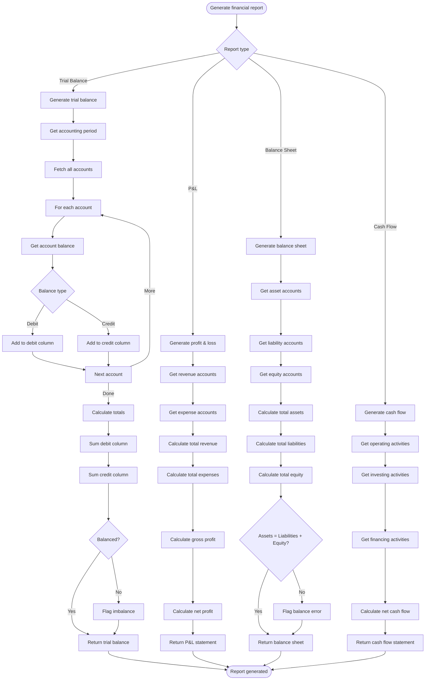
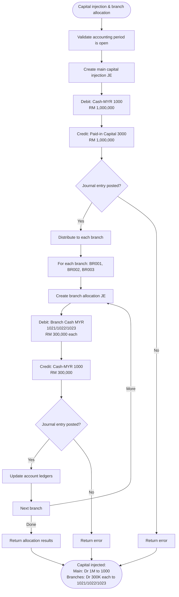

# CEMS-MY Accounting Flow Chart

## Overview
This flow chart documents the complete accounting and ledger flow in CEMS-MY, including journal entry creation, ledger updates, reversal, and financial reporting.

## Journal Entry Creation Flow

```mermaid
flowchart TD
    Start([Create journal entry]) --> ValidateLines[Validate journal lines]
    ValidateLines -->|Invalid| ReturnError[Return validation error]
    ValidateLines -->|Valid| CheckBalanced[Check debits equal credits]
    CheckBalanced -->|Not balanced| ReturnBalanceError[Return unbalanced error]
    CheckBalanced -->|Balanced| FindPeriod[Find accounting period]
    FindPeriod --> CheckPeriod{Period exists?}
    CheckPeriod -->|Yes| CheckOpen[Check period is open]
    CheckPeriod -->|No| UseDefault[Use default period]
    CheckOpen -->|Closed| ReturnPeriodError[Return period closed error]
    CheckOpen -->|Open| CreateEntry[Create JournalEntry record]
    UseDefault --> CreateEntry
    CreateEntry --> SetEntryDate[Set entry_date]
    SetEntryDate --> SetPeriodId[Set period_id]
    SetPeriodId --> SetReference[Set reference_type and reference_id]
    SetReference --> SetDescription[Set description]
    SetDescription --> SetPostedStatus[Set status to Posted]
    SetPostedStatus --> SetPostedBy[Set posted_by user]
    SetPostedBy --> SetPostedAt[Set posted_at timestamp]
    SetPostedAt --> CreateLines[Create JournalLine records]
    CreateLines --> ForEachLine[For each journal line]
    ForEachLine --> CreateLine[Create JournalLine record]
    CreateLine --> SetAccountCode[Set account_code]
    SetAccountCode --> SetDebit[Set debit amount]
    SetDebit --> SetCredit[Set credit amount]
    SetCredit --> SetLineDescription[Set line description]
    SetLineDescription --> NextLine[Next line]
    NextLine -->|More| ForEachLine
    NextLine -->|Done| UpdateLedger[Update account ledger]
    UpdateLedger --> ForEachLedger[For each journal line]
    ForEachLedger --> GetAccountBalance[Get current account balance]
    GetAccountBalance --> CheckAccountType{Account type}
    CheckAccountType -->|Asset/Expense| CalculateDebitBalance[Calculate new balance: +debit -credit]
    CheckAccountType -->|Liability/Equity/Revenue| CalculateCreditBalance[Calculate new balance: +credit -debit]
    CalculateDebitBalance --> CreateLedgerEntry[Create AccountLedger record]
    CalculateCreditBalance --> CreateLedgerEntry
    CreateLedgerEntry --> SetLedgerAccount[Set account_code]
    SetLedgerAccount --> SetLedgerDate[Set entry_date]
    SetLedgerDate --> SetJournalId[Set journal_entry_id]
    SetJournalId --> SetLedgerDebit[Set debit]
    SetLedgerDebit --> SetLedgerCredit[Set credit]
    SetLedgerCredit --> SetRunningBalance[Set running_balance]
    SetRunningBalance --> NextLedger[Next ledger line]
    NextLedger -->|More| ForEachLedger
    NextLedger -->|Done| LogAudit[Log journal entry created]
    LogAudit --> ReturnEntry[Return journal entry]
    ReturnEntry --> End([Journal entry created])
```



## Transaction Accounting Flow

```mermaid
flowchart TD
    Start([Transaction completed]) --> CheckType{Transaction type}
    CheckType -->|Buy| CreateBuyEntries[Create buy accounting entries]
    CheckType -->|Sell| CreateSellEntries[Create sell accounting entries]

    CreateBuyEntries --> CreateInventoryDebit[Create inventory debit]
    CreateInventoryDebit --> SetInventoryAccount[Set account to FOREIGN_CURRENCY_INVENTORY]
    SetInventoryAccount --> SetInventoryDebitAmount[Set debit to amount_local]
    SetInventoryDebitAmount --> SetInventoryCredit[Set credit to 0]
    SetInventoryCredit --> SetInventoryDesc[Set description]
    SetInventoryDesc --> CreateCashCredit[Create cash credit]
    CreateCashCredit --> SetCashAccount[Set account to CASH_MYR]
    SetCashAccount --> SetCashDebit[Set debit to 0]
    SetCashDebit --> SetCashCreditAmount[Set credit to amount_local]
    SetCashCreditAmount --> SetCashDesc[Set description]
    SetCashDesc --> CreateJournal[Create journal entry]
    CreateJournal --> ReturnBuy[Return buy journal]

    CreateSellEntries --> GetPosition[Get currency position]
    GetPosition --> CalculateAvgCost[Calculate average cost rate]
    CalculateAvgCost --> CalculateCostBasis[Calculate cost basis]
    CalculateCostBasis --> CalculateRevenue[Calculate revenue = amount_local - cost_basis]
    CalculateRevenue --> CheckGain{Gain or loss?}
    CheckGain -->|Gain| CreateGainEntry[Create gain entry]
    CheckGain -->|Loss| CreateLossEntry[Create loss entry]

    CreateGainEntry --> CreateCashDebit[Create cash debit]
    CreateCashDebit --> SetCashAccount[Set account to CASH_MYR]
    SetCashAccount --> SetCashDebitAmount[Set debit to amount_local]
    SetCashDebitAmount --> SetCashCredit[Set credit to 0]
    SetCashCredit --> SetCashDesc[Set description]
    SetCashDesc --> CreateInventoryCredit[Create inventory credit]
    CreateInventoryCredit --> SetInventoryAccount[Set account to FOREIGN_CURRENCY_INVENTORY]
    SetInventoryAccount --> SetInventoryDebit[Set debit to 0]
    SetInventoryCredit --> SetInventoryCreditAmount[Set credit to cost_basis]
    SetInventoryCreditAmount --> SetInventoryDesc[Set description]
    SetInventoryDesc --> CreateRevenueCredit[Create revenue credit]
    CreateRevenueCredit --> SetRevenueAccount[Set account to FOREX_TRADING_REVENUE]
    SetRevenueAccount --> SetRevenueDebit[Set debit to 0]
    SetRevenueDebit --> SetRevenueCreditAmount[Set credit to revenue]
    SetRevenueCreditAmount --> SetRevenueDesc[Set description]
    SetRevenueDesc --> CreateSellJournal[Create sell journal]
    CreateSellJournal --> ReturnSell[Return sell journal]

    CreateLossEntry --> CreateCashDebit2[Create cash debit]
    CreateCashDebit2 --> SetCashAccount2[Set account to CASH_MYR]
    SetCashAccount2 --> SetCashDebitAmount2[Set debit to amount_local]
    SetCashDebitAmount2 --> SetCashCredit2[Set credit to 0]
    SetCashCredit2 --> SetCashDesc2[Set description]
    SetCashDesc2 --> CreateInventoryCredit2[Create inventory credit]
    CreateInventoryCredit2 --> SetInventoryAccount2[Set account to FOREIGN_CURRENCY_INVENTORY]
    SetInventoryAccount2 --> SetInventoryDebit2[Set debit to 0]
    SetInventoryCredit2 --> SetInventoryCreditAmount2[Set credit to cost_basis]
    SetInventoryCreditAmount2 --> SetInventoryDesc2[Set description]
    SetInventoryDesc2 --> CreateLossDebit[Create loss debit]
    CreateLossDebit --> SetLossAccount[Set account to FOREX_LOSS]
    SetLossAccount --> SetLossDebitAmount[Set debit to abs(revenue)]
    SetLossDebitAmount --> SetLossCredit[Set credit to 0]
    SetLossCredit --> SetLossDesc[Set description]
    SetLossDesc --> CreateSellJournal2[Create sell journal]
    CreateSellJournal2 --> ReturnSell2[Return sell journal]

    ReturnBuy --> End([Accounting entries created])
    ReturnSell --> End
    ReturnSell2 --> End
```

## Journal Entry Reversal Flow



## Till Balance Update Flow



## Financial Reporting Flow



## Account Codes

```mermaid
flowchart TD
    Start([Account codes]) --> AssetAccounts[Asset accounts]
    AssetAccounts --> CashMYR[CASH_MYR - Cash in MYR<br/>1000 - Main house account]
    AssetAccounts --> BranchCashMYR[Branch MYR Cash<br/>1021 - BR001 | 1022 - BR002 | 1023 - BR003]
    AssetAccounts --> ForeignInventory[FOREIGN_CURRENCY_INVENTORY - Foreign currency inventory]
    AssetAccounts --> AccountsReceivable[ACCOUNTS_RECEIVABLE - Accounts receivable]

    Start --> LiabilityAccounts[Liability accounts]
    LiabilityAccounts --> AccountsPayable[ACCOUNTS_PAYABLE - Accounts payable]
    LiabilityAccounts --> AccruedExpenses[ACCRUED_EXPENSES - Accrued expenses]

    Start --> EquityAccounts[Equity accounts]
    EquityAccounts --> OwnerEquity[OWNER_EQUITY - Owner's equity]
    EquityAccounts --> PaidInCapital[PAID-IN CAPITAL - Paid-in capital<br/>3000]
    EquityAccounts --> RetainedEarnings[RETAINED_EARNINGS - Retained earnings]

    Start --> RevenueAccounts[Revenue accounts]
    RevenueAccounts --> ForexRevenue[FOREX_TRADING_REVENUE - Forex trading revenue]
    RevenueAccounts --> OtherRevenue[OTHER_REVENUE - Other revenue]

    Start --> ExpenseAccounts[Expense accounts]
    ExpenseAccounts --> ForexLoss[FOREX_LOSS - Forex loss]
    ExpenseAccounts --> OperatingExpenses[OPERATING_EXPENSES - Operating expenses]
    ExpenseAccounts --> OtherExpenses[OTHER_EXPENSES - Other expenses]
```

## Double-Entry Bookkeeping

```
Every transaction must balance:
Total Debits = Total Credits

Account Types:
- Asset accounts: Normal debit balance
- Liability accounts: Normal credit balance
- Equity accounts: Normal credit balance
- Revenue accounts: Normal credit balance
- Expense accounts: Normal debit balance

Balance Calculation:
- Debit accounts: New Balance = Old Balance + Debit - Credit
- Credit accounts: New Balance = Old Balance + Credit - Debit
```

## Capital & Branch Fund Allocation Flow



## API Endpoints

| Endpoint | Method | Description | Auth Required |
|----------|--------|-------------|---------------|
| `/api/v1/accounting/journal-entries` | POST | Create journal entry | Manager, Admin |
| `/api/v1/accounting/journal-entries/{id}/reverse` | POST | Reverse journal entry | Manager, Admin |
| `/api/v1/accounting/journal-entries/{id}` | GET | Get journal entry | All roles |
| `/api/v1/accounting/journal-entries` | GET | List journal entries | All roles |
| `/api/v1/accounting/ledger/{account_code}` | GET | Get account ledger | All roles |
| `/api/v1/accounting/trial-balance` | GET | Get trial balance | Manager, Admin |
| `/api/v1/accounting/profit-loss` | GET | Get P&L statement | Manager, Admin |
| `/api/v1/accounting/balance-sheet` | GET | Get balance sheet | Manager, Admin |
| `/api/v1/accounting/cash-flow` | GET | Get cash flow statement | Manager, Admin |

## Key Services

| Service | Purpose |
|---------|---------|
| `AccountingService` | Journal entry creation and reversal |
| `LedgerService` | Ledger queries and financial reporting |
| `RevaluationService` | Monthly currency revaluation |
| `MathService` | BCMath precision calculations |
| `AuditService` | Audit logging |

## Account Code Enum

```php
enum AccountCode {
    // Asset accounts
    case CASH_MYR = '1000';                    // Main house MYR cash
    case BR001_CASH_MYR = '1021';              // BR001 branch MYR cash
    case BR002_CASH_MYR = '1022';              // BR002 branch MYR cash
    case BR003_CASH_MYR = '1023';              // BR003 branch MYR cash
    case FOREIGN_CURRENCY_INVENTORY = '1100';
    case ACCOUNTS_RECEIVABLE = '1200';
    // Liability accounts
    case ACCOUNTS_PAYABLE = '2000';
    case ACCRUED_EXPENSES = '2100';
    // Equity accounts
    case OWNER_EQUITY = '3000';
    case PAID_IN_CAPITAL = '3001';             // Paid-in capital
    case RETAINED_EARNINGS = '3100';
    // Revenue accounts
    case FOREX_TRADING_REVENUE = '4000';
    case OTHER_REVENUE = '4100';
    // Expense accounts
    case FOREX_LOSS = '5000';
    case OPERATING_EXPENSES = '5100';
    case OTHER_EXPENSES = '5200';
}
```

## Transaction Accounting Examples

### Buy Transaction
```
Debit:  FOREIGN_CURRENCY_INVENTORY  RM 10,000
Credit: CASH_MYR                     RM 10,000
```

### Sell Transaction (Gain)
```
Debit:  CASH_MYR                     RM 12,000
Credit: FOREIGN_CURRENCY_INVENTORY  RM 10,000 (cost basis)
Credit: FOREX_TRADING_REVENUE       RM 2,000 (gain)
```

### Sell Transaction (Loss)
```
Debit:  CASH_MYR                     RM 9,000
Debit:  FOREX_LOSS                   RM 1,000
Credit: FOREIGN_CURRENCY_INVENTORY  RM 10,000 (cost basis)
```

### Capital Injection (Paid-in Capital)
```
Debit:  CASH_MYR            RM 1,000,000
Credit: PAID-IN CAPITAL      RM 1,000,000
```

### Branch Fund Allocation
```
Debit:  BR001 Cash MYR (1021)  RM 300,000
Debit:  BR002 Cash MYR (1022)  RM 300,000
Debit:  BR003 Cash MYR (1023)  RM 300,000
Credit: CASH_MYR               RM 900,000
```

## Period Management

- **Open Period**: Journal entries can be created
- **Closed Period**: No journal entries allowed
- **Period Closing**: Finalizes period for reporting
- **Period Reopening**: Requires admin approval

## Precision

All monetary calculations use BCMath for precision:
- No floating-point arithmetic
- String-based calculations
- Configurable decimal precision (default: 4)
