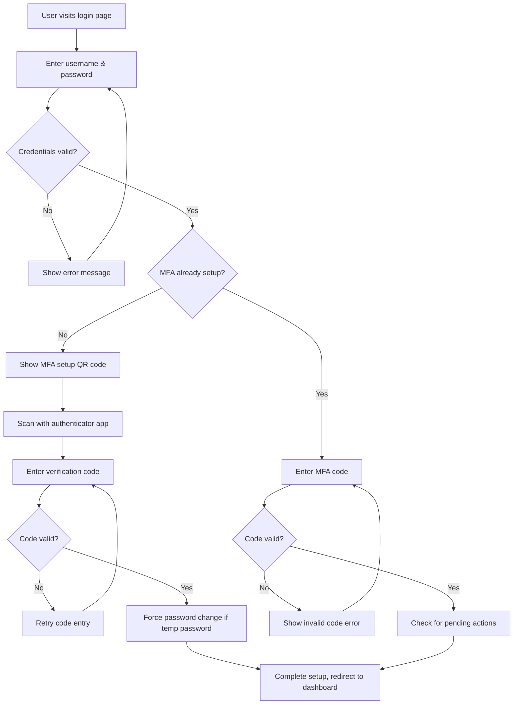
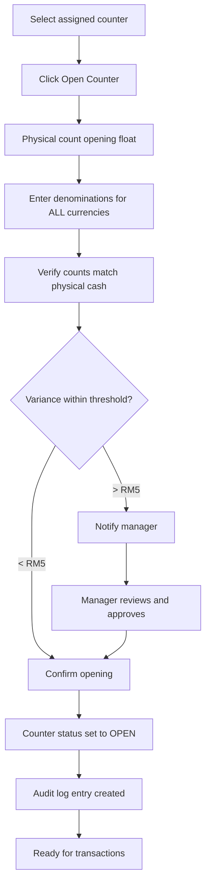
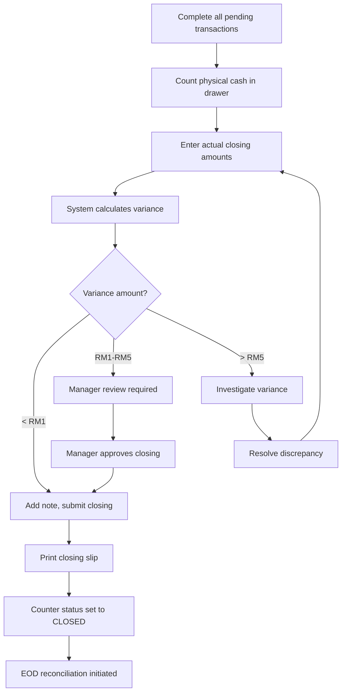
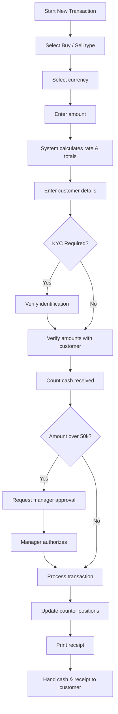
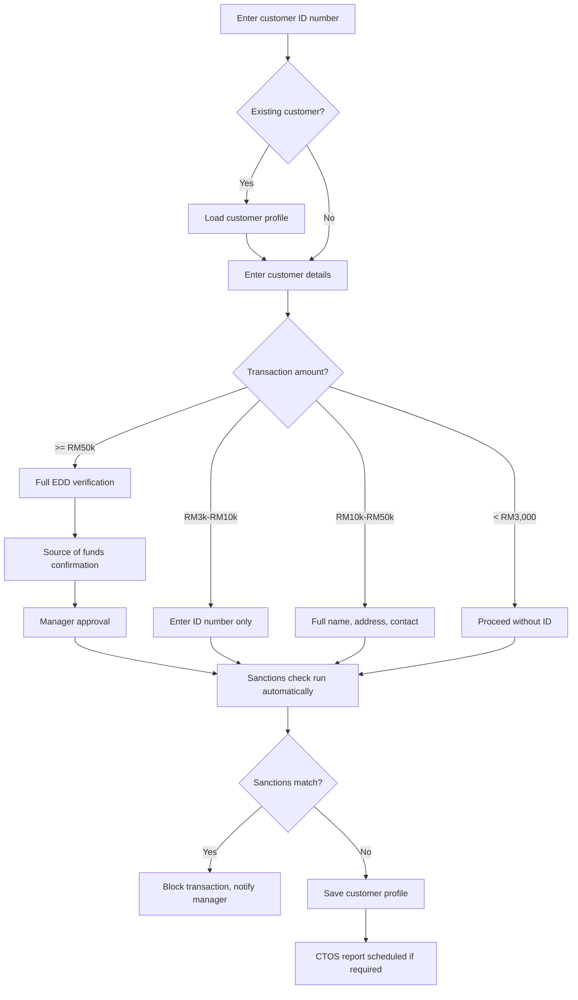
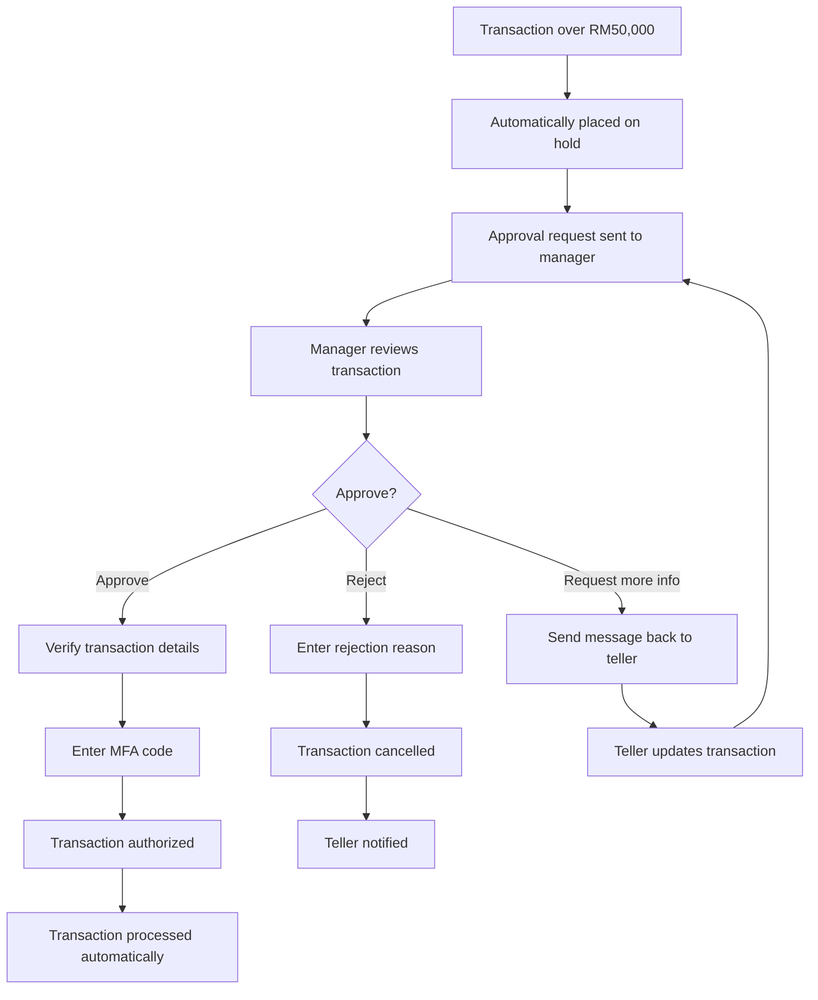
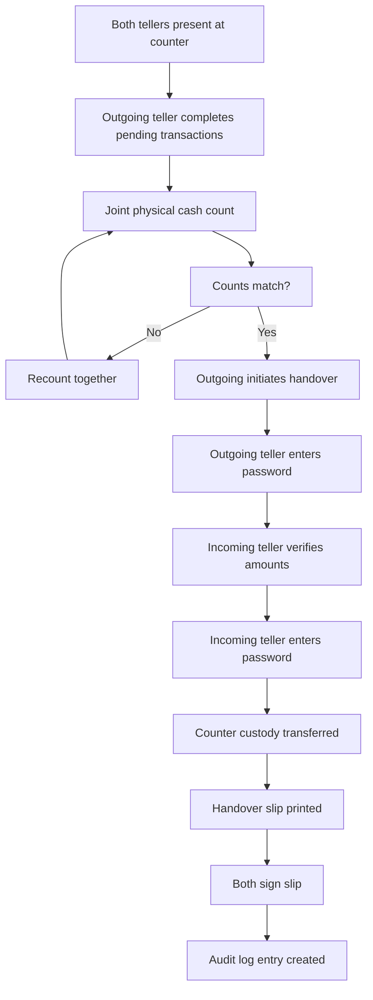
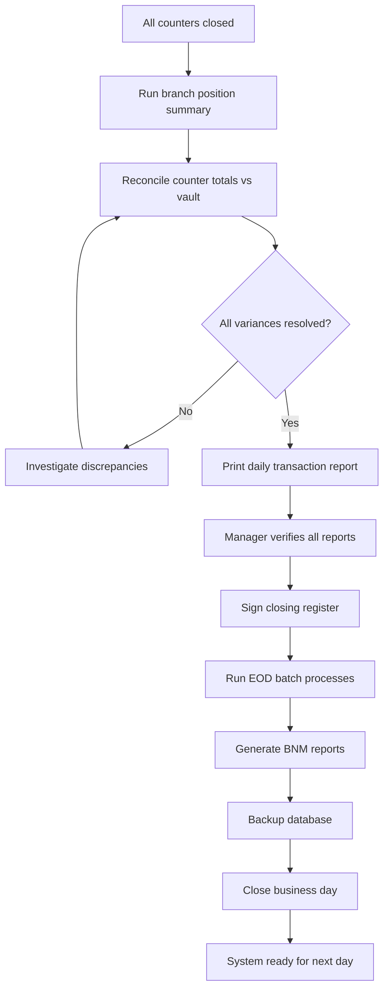

# User Manual Workflow Diagrams Implementation Plan

> **For agentic workers:** REQUIRED SUB-SKILL: Use superpowers:subagent-driven-development (recommended) or superpowers:executing-plans to implement this plan task-by-task. Steps use checkbox (`- [ ]`) syntax for tracking.

**Goal:** Add 8 system workflow diagrams using mermaid syntax to the user manual, one under each corresponding section.

**Architecture:** Each workflow diagram will be inserted as a markdown mermaid code block directly after the heading for each section, before the existing content. All diagrams use standard mermaid flowchart syntax.

**Tech Stack:** Mermaid v10, Laravel Blade, HTML

---

## Task 1: Login & MFA Workflow Diagram

**Files:**
- Modify: `resources/views/user-manual/index.blade.php:71-72`

- [ ] **Step 1: Insert diagram after section heading**

Add this immediately after line 72:

- [ ] **Step 2: Run lint check**
Run: `./vendor/bin/pint resources/views/user-manual/index.blade.php`
Expected: No errors, file formatted correctly

---

## Task 2: Counter Opening Workflow Diagram

**Files:**
- Modify: `resources/views/user-manual/index.blade.php:137-138`

- [ ] **Step 1: Insert diagram after section heading**

Add this immediately after line 138:

---

## Task 3: Counter Closing Workflow Diagram

**Files:**
- Modify: `resources/views/user-manual/index.blade.php:171-172`

- [ ] **Step 1: Insert diagram after section heading**

---

## Task 4: Transaction Processing Workflow Diagram

**Files:**
- Modify: `resources/views/user-manual/index.blade.php:240-241`

- [ ] **Step 1: Insert diagram after section heading**

---

## Task 5: Customer Creation & KYC Workflow Diagram

**Files:**
- Modify: `resources/views/user-manual/index.blade.php:296-297`

- [ ] **Step 1: Insert diagram after section heading**

---

## Task 6: Transaction Approval Workflow Diagram

**Files:**
- Modify: `resources/views/user-manual/index.blade.php:336-337`

- [ ] **Step 1: Insert diagram after section heading**

---

## Task 7: Shift Handover Workflow Diagram

**Files:**
- Modify: `resources/views/user-manual/index.blade.php:216-217`

- [ ] **Step 1: Insert diagram after section heading**

---

## Task 8: End of Day Closing Workflow Diagram

**Files:**
- Modify: `resources/views/user-manual/index.blade.php:467-468`

- [ ] **Step 1: Insert diagram after section heading**

---

## Final Verification

- [ ] All 8 diagrams are added correctly under each corresponding section
- [ ] Mermaid syntax is valid
- [ ] Blade template still renders correctly
- [ ] Code style follows project conventions
- [ ] All diagrams are using standard flowchart symbols consistent with each other

Plan complete and saved to `docs/superpowers/plans/2026-04-16-user-manual-workflow-diagrams.md`. Two execution options:

**1. Subagent-Driven (recommended)** - I dispatch a fresh subagent per task, review between tasks, fast iteration

**2. Inline Execution** - Execute tasks in this session using executing-plans, batch execution with checkpoints

Which approach?
